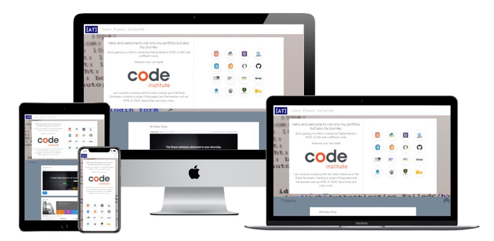
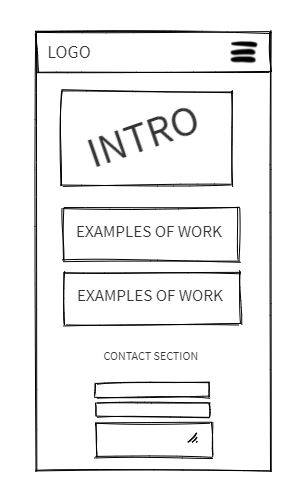

# Milestone Project 1 - Alex Truss 

## Portfolio site
[Click here](https://alextruss.github.io/Project-1/) for the live site.

The aim of this project was to build a portfolio website for myself as a place to show off the progress of my course and showcase my portfolio pieces as i go along. The end game for the site is to be the basis of my portfolio and online presence going forwards. The site will be an access point to information about myself and a way to contact me through a range of options, such as email, phone and social media.

## User Experience (UX)
First time visitor goals
<ul>
<li>Immediatly understand what the message of the site is.
<li>Easily navigate the site using navbar and return to top buttons.
<li>Allow visitors to contact me regrding current work and possile commisions.
</ul>

Returning visitor goals
<ul>
<li>Allow visitors to visit my portfolio to browse new work.
<li>Allow visitors to access my new social media links.
</ul>

##Design

I decided early on that the site needed to be a single page design to make it easier for mobile navigation. It will be a responsive design to allow it to seemlessly transition between mobile devices and desktop/laptop PC's.

