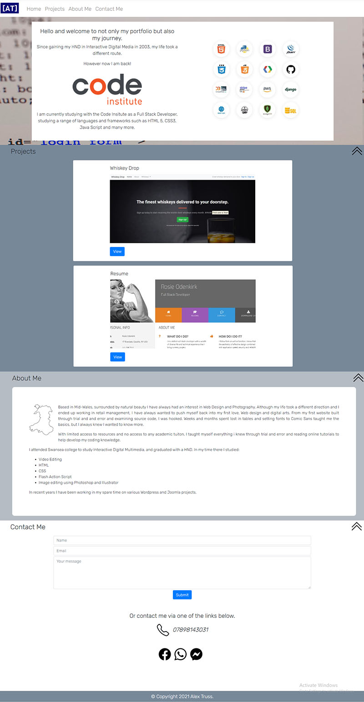

# Milestone Project 1 - Alex Truss 

## Portfolio site

[Click here](https://alextruss.github.io/Project-1/) for the live site.

The aim of this project was to build a portfolio website for myself as a place to show off the progress of my course and showcase my portfolio pieces as i go along. The end game for the site is to be the basis of my portfolio and online presence going forwards. The site will be an access point to information about myself and a way to contact me through a range of options, such as email, phone and social media.

## User Experience (UX)

First time visitor goals
<ul>
<li>Immediatly understand what the message of the site is.
<li>Easily navigate the site using navbar and return to top buttons.
<li>Allow visitors to contact me regrding current work and possile commisions.
<li>Allow visitors to visit my portfolio.
</ul>

Returning visitor goals
<ul>
<li>Allow visitors to revisit my portfolio and to browse new work.
<li>Allow visitors to access my new social media links.
</ul>

## Design

I decided early on that the site needed to be a single page design to make it easier for mobile navigation. It will be a responsive design to allow it to seemlessly transition between mobile devices and desktop/laptop PC's. The site navigation will be located at the top, with links to return to top situated in each secton of the site.

### Wireframe

I want to stck with a minialistic design, using greys, white and blue as my colour scheme.

## Technologies Used

<ul>
<li>HTML 5
<li>CSS
<li>Java Script
<li>Bootstrap for responsive design and page componants
<li>Google fonts for additional font used on the site
</ul>

## Final Design screenshots

### Desktop

### Ipad

### Mobile phone (Android)

## Testing

### Basic Use Test

MY first test was to manually test each link and element on the site. I carried out this test on both desktop and mobile devices. Each link in the navigation bar worked as expected, opening in a new tab. Each  succesfully returned the page to the top nav bar.
When tested on mobile devices the social media links successfully loaded the relevent app and allowed for expected usage.
The email form was designed to not actually send an email at this point but just to display the modal popup message. This worked perfectly on all browswers and platforms.

I also tested switching between resolutions to ensure the menu whould switch between styles according to the screen size. This worked perfectly during testing.

### Cross Browser Testing

I have cross browser tested on Chrome, Firefox, Safari and Edge. The result is very universal across Chrome, Firefox and Edge, with all elements performing and displaying as expected. On Safari However I notice a few issues, as highlighted in the last image above. 
<ul>
<li> Navigation menu doesnt display at 100% browser size
<li> Background image for intro section doesnt display.
</ul>

I have also tested it on 3 different default mobile browsers. All displayed correctly and features such as the nav system worked as expected.

### User Stories and feedback for testing

I forwarded the link and screenshots taken on my device,to 3 peers who I knew had different mobile devices. One an Iphone 12, One a Samsung S20 and the third a Huawei P30 Pro. I Asked them to rely with answers to 3 questions:
<ol>
<li> Does the site display on your device in a similar manor to the screenshots in terms of layout and content?
<li> Did you find it easy to understand and navigate the site?
<li> Did all navigation links, both at the top and in the contact me section work correctly?
</ol>
All three responded yes to each question.

Based on my initial outline for the user experience, I asked fr feedback based on the original User experience outline.

Feedback I recieved

<ul>
<li>Immediatly understand what the message of the site is - *All three felt it instantly was clear what the sites message was*.
<li>Easily navigate the site using navbar and return to top buttons - *No issues were reported regarding navigation and 2 out of the three stated the return to top buttons were a good feature.*
<li>Allow visitors to contact me regrding current work and possile commisions - *This is a non functioning section of the site but each user understood how to use the feature if it were to go live.*
<li>Allow visitors to visit my portfolio - *Each user said they liked the portfolio section and was very simple to navigate.*
</ul>

Returning visitor goals
<ul>
<li>Allow visitors to revisit my portfolio and to browse new work -*No issues raised around this element of the site.*
<li>Allow visitors to access my new social media links - *Each user sent me mesages via the social media links to test it worked well from third parties.*
</ul>

### know Issue

I am aware that the site does not display well in Safari. I have not been able to fix this as yet due to the limitations of using a Windows PC. Going forwards I believe I could adjust the css style sheet to allow for the display issues.

### Validation

The final site was tested and validated with [WC3 HTML Validator](https://validator.w3.org/) 

and [WC3 CSS Validator](https://jigsaw.w3.org/css-validator/). 

My original css failed due to an unclosed {}.

After the relevant changes both returned fully validated with the exception of a few warnings regarding some of the Bootstrap style. I was told this is expected and does not effect my code.

## Deployment and cloning

This website has been deployed to GitHub pages, to access [Click here](https://alextruss.github.io/Project-1/)

To create and publish my project I used Github to create the repositories. This projects repository can be found at https://github.com/Alextruss/Project-1 

To clone the repository you will need to access this link, then Select the code button. This will give you access to clone the repository or download a zip copy of the repository.

## Credits (element sources)

Background image used in inro section - unsplash.com:
(https://images.unsplash.com/photo-1610466896927-699424f3c86d?ixid=MnwxMjA3fDB8MHxwaG90by1wYWdlfHx8fGVufDB8fHx8&ixlib=rb-1.2.1&auto=format&fit=crop&w=1502&q=80S)

Wales outline image:
https://www.pikpng.com/pngvi/hThhRhT_wales-map-england-png-image-outline-map-of-wales-clipart/

Navigation bar code from Bootstrap: 
https://getbootstrap.com/docs/4.6/components/navbar/

Flexbox grid system code from Bootstrap:
https://getbootstrap.com/docs/4.3/layout/grid/

Card component from bootstrap:
https://getbootstrap.com/docs/4.6/components/card/

Contact form from Bootstrap: 
https://getbootstrap.com/docs/4.6/components/forms/

Modal popup from boostrap:
https://getbootstrap.com/docs/4.6/components/modal/

Whatsapp, Facebook and Messenger icons:
https://icons.getbootstrap.com/

Code Institute Graphics:
https://codeinstitute.net/ and Emails sent to me from the Code Institute.

Each of the two examples on the portfolio section are from Code Institutes examples used in the training modules.

